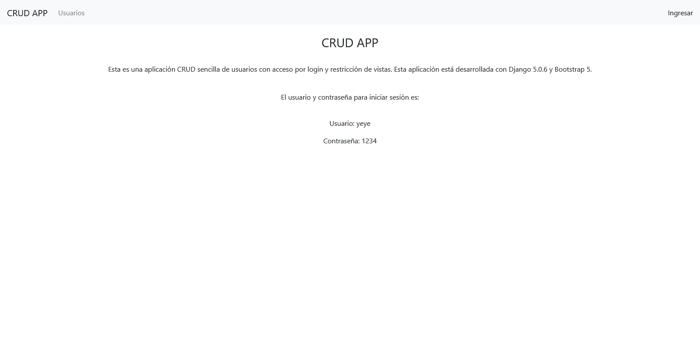
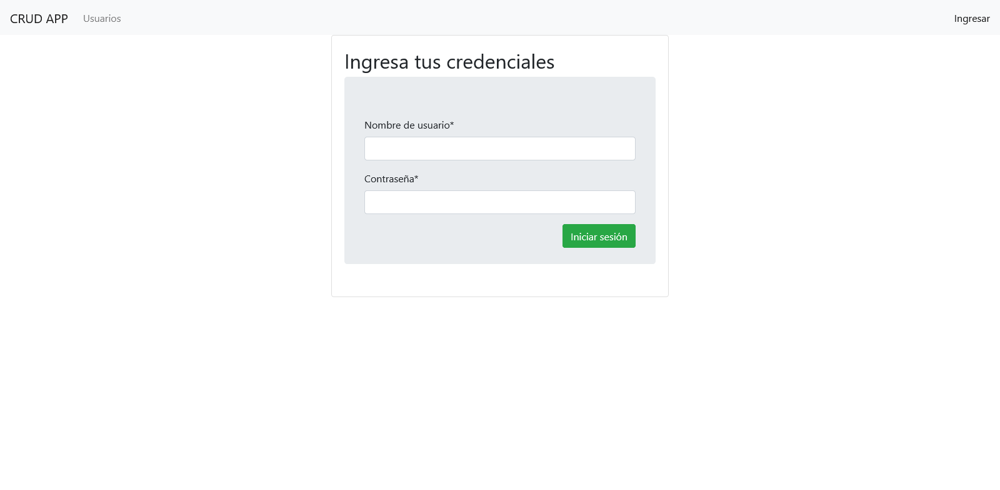
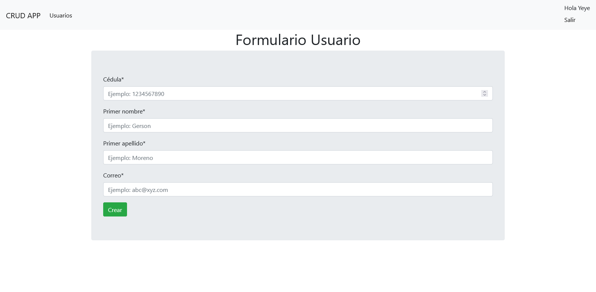

# CRUD App con Django y Bootstrap 5

Esta es una aplicación CRUD sencilla de usuarios con acceso por login y restricción de vistas y funcionalidades. Esta aplicación está desarrollada con Django 5.0.6 y bootstrap 5.

## Funcionalidades

- Login.
- Crear usuarios.
- Leer usuarios.
- Actualizar usuarios.
- Eliminar usuarios.

## Vistas

### Home

### Login

### Lista de usuarios

### Crear y actualizar usuario

